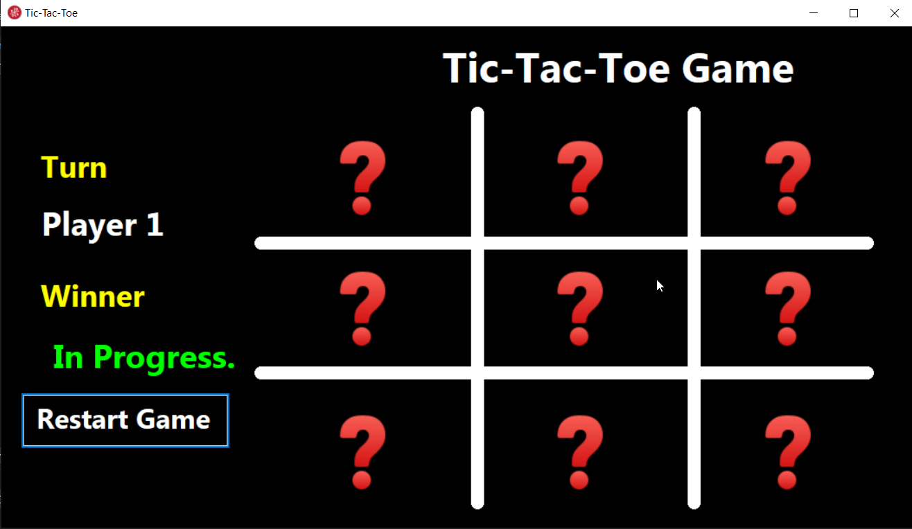

---

# 🎮 Tic-Tac-Toe – Windows Forms App

## 📸 Screenshot


A simple two-player **Tic-Tac-Toe** game built using **C# and Windows Forms** (.NET Framework).  
This project demonstrates basic game logic, event-driven programming, and UI development in a desktop environment.

---

## 🚀 Features
- Classic 3x3 Tic-Tac-Toe grid  
- Two-player mode  
- Win and draw detection  
- Reset functionality  
- Basic Windows Forms UI  

---

## 🛠️ How to Run This Project
#option 1:
1. **Clone the repository**:
   ```
   git clone https://github.com/your-username/tic-tac-toe-winforms.git
   ```

2. **Open the solution**:
   - Navigate to the project folder  
   - Open the `.sln` file with **Visual Studio**

3. **Build and Run**:
   - Press **F5** or click **"Start"**

✅ Make sure you have:
- Visual Studio installed  
- Targeting **.NET Framework 4.x**


#option 2:
## 💾 Download

Want to try the game without building the code?

👉 [Download Installer (ZIP)](Tic-Tac-Toe.rar)

### 🧑‍💻 How to Install

1. Download the ZIP file.
2. Extract it anywhere.
3. Run the setup file to install the game.

---

## 📂 Project Structure
```
TicTacToeGame/
├── Form1.cs         # Main game logic and UI
├── Form1.Designer.cs
├── Program.cs       # Entry point
├── TicTacToeGame.sln
└── README.md
```

---

## 📄 License
This project is open-source and free to use for educational or personal purposes.

---

## ✍️ Author
Mohamed Hegazi Bahlol – [LinkedIn](https://www.linkedin.com/in/mohamed-hodaib-2670b2344) | [GitHub](https://github.com/mohamedHodaib)


---

